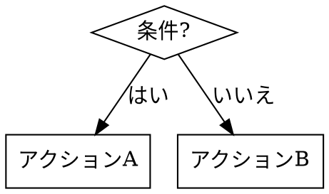
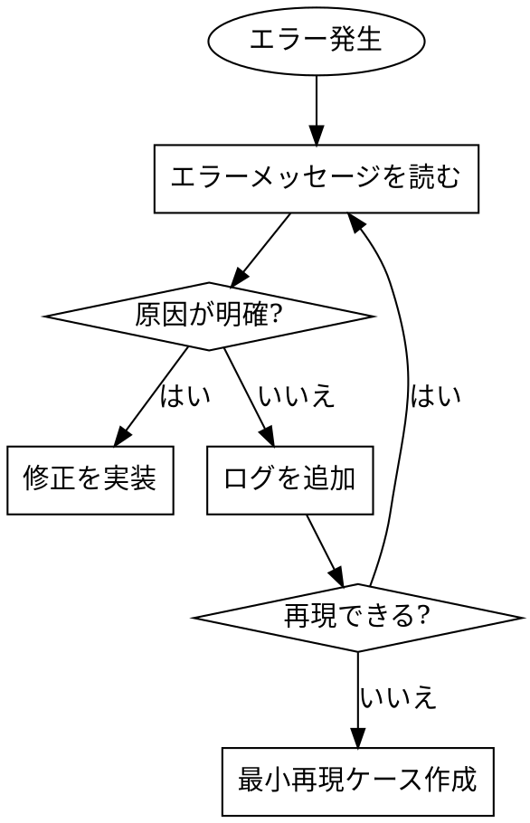

# 高度なスキル設計テクニック

基本的なスキル作成を超えた、効果的なスキル設計のための高度なテクニックを解説します。

---

## 説得技法

スキルが確実に従われるための4つの原則:

### 1. コミットメントと一貫性

小さなステップから始め、徐々に大きなコミットメントへ導く。

```markdown
## ワークフロー

1. まず現在の状態を確認（小さなステップ）
2. 問題点を特定（理解を深める）
3. 解決策を検討（選択肢を提示）
4. 実装を開始（大きなコミットメント）
```

**ポイント**: 最初のステップは必ず実行可能な簡単なものにする

### 2. 社会的証明

実例とインパクトを示す。

```markdown
## なぜこのスキルが重要か

- チームAはこのワークフローで開発時間を50%短縮
- 1日かかっていた作業が1時間で完了
- バグの発生率が80%減少
```

**ポイント**: 具体的な数字や事例で効果を示す

### 3. 権威

ベストプラクティスやスタンダードを参照する。

```markdown
## 根拠

このワークフローは以下に基づいています:
- Anthropic 公式指針
- Claude Code ベストプラクティス
- 業界標準のTDD手法
```

**ポイント**: 信頼できる情報源を明示する

### 4. 理由

なぜ各ステップが重要かを説明する。

```markdown
## ステップ1: テストを先に書く

**なぜ?** テストを先に書くことで:
- 仕様が明確になる
- 実装の方向性が決まる
- 完了条件が明確になる
```

**ポイント**: 「なぜ?」に答える説明を各ステップに付ける

---

## 危険信号セクション

ユーザーが間違った道に進むのを防ぐための警告セクション。

### 書き方

```markdown
## 危険信号 - 停止

以下を考えている自分に気づいたら:
- 「今回だけスキップ」
- 「このケースは違う」
- 「後でやる」
- 「時間がないから」

**停止。プロセスに戻る。**

これらの考えは、後で大きな問題を引き起こす前兆です。
```

### 効果的な危険信号の特徴

1. **具体的な言い訳を列挙**: ユーザーが考えがちな言い訳を先回りして提示
2. **明確な指示**: 「停止」「戻る」など、取るべきアクションを明示
3. **理由の説明**: なぜ危険なのかを簡潔に説明

### 実例

```markdown
## 危険信号 - テストスキップ禁止

以下を考えている自分に気づいたら:
- 「このコードは簡単だからテスト不要」
- 「時間がないから後でテストを書く」
- 「リファクタリングだけだから大丈夫」

**停止。テストを先に書く。**

「簡単なコード」こそバグが潜みやすい。
```

---

## 統合ポイント

他のスキルとの接続を明確にするセクション。

### 書き方

```markdown
## 統合

**このスキルは以下を使用必須:**
- **test-driven-development** - テスト作成時に必須
- **systematic-debugging** - テスト失敗時に必須

**このスキルを呼び出すもの:**
- **writing-plans** - 計画のステップ4で使用
- **code-review** - レビュー時に参照
```

### 統合の種類

| 種類 | 説明 | 例 |
|------|------|-----|
| **使用必須** | このスキル実行時に必ず使う | TDDスキル → テスト作成 |
| **呼び出し元** | このスキルを呼び出すスキル | 計画スキル → 実装スキル |
| **代替** | 状況により代替可能 | デバッグA ↔ デバッグB |
| **補完** | 組み合わせて使用推奨 | 設計 + レビュー |

### なぜ統合ポイントが重要か

1. **一貫性**: スキル間の連携が明確になる
2. **発見性**: 関連スキルを見つけやすくなる
3. **完全性**: 必要なスキルの漏れを防ぐ

---

## Graphviz 決定フロー

複雑な決定には図を使用して視覚化する。

### 基本構文



### 実例: デバッグフロー



### 図を使うべき場面

- 条件分岐が3つ以上ある
- ループや繰り返しがある
- 複数の経路がある
- テキストだけでは理解しにくい

---

## テストと共有

### スキルのテスト

スキルを書いた後は、サブエージェントを使ってテストする:

1. 様々なシナリオでスキルを実行
2. 期待通りに動作するか確認
3. フィードバックに基づいて改善

参照: `sp-testing-skills-with-subagents` スキル

### スキルの共有

スキルを共有する準備ができたら:

1. ブランチを作成
2. PRを提出
3. コミュニティフィードバックを受ける

参照: `sp-sharing-skills` スキル

---

## チェックリスト

高度なテクニックを適用する前に確認:

- [ ] 説得技法（4つの原則）を適用しているか
- [ ] 危険信号セクションで誤用を防いでいるか
- [ ] 統合ポイントで他スキルとの関係を明示しているか
- [ ] 複雑な決定はGraphvizで視覚化しているか
- [ ] テストを実施したか
